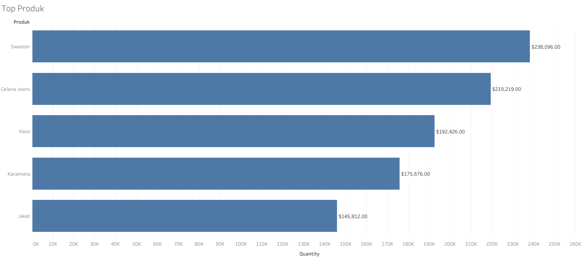
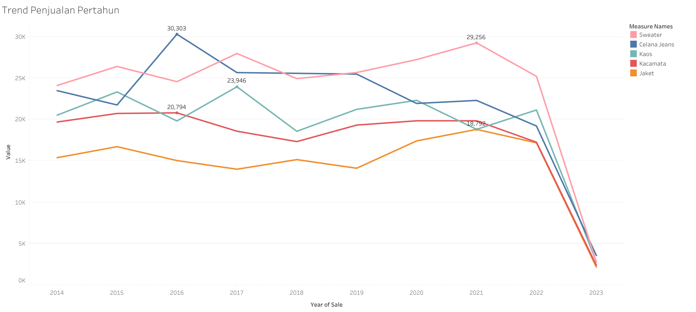
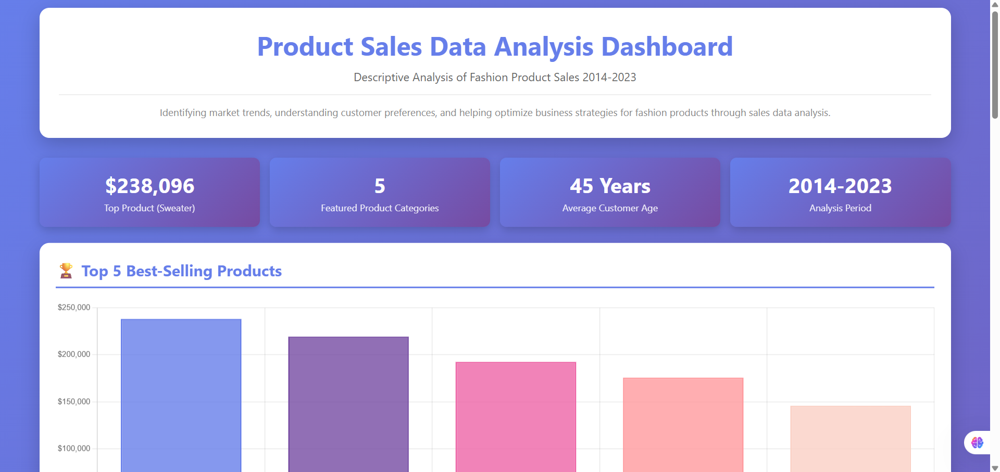

# 👕 Product Sales Analysis Dashboard – Diki Darmawan

## 📘 Overview
This project features an interactive dashboard visualizing key factors influencing product sales performance in the fashion industry.  
The dashboard provides insights into **sales trends, production patterns, and customer demographics** that affect product revenue from **2014 to 2023**.

---

## 🎯 Project Scope
- Analyze and visualize sales trends across different product categories over a 10-year period.  
- Display the correlation between production volume and sales revenue.  
- Show the impact of customer demographics (age and location) on product preferences.  
- Identify top-performing products and declining trends.  
- Provide actionable recommendations to improve sales performance and inventory management.

---

## ⚙️ Features
- Visual and interactive representation of sales data with multiple chart types.  
- Clear insights and contextual explanations for each visualization.  
- Responsive dashboard design accessible on desktop and mobile devices.  
- Tabbed interface for organized presentation of **Conclusions**, **Recommendations**, and **Methodology**.  
- Real-time interactive charts with hover effects for detailed data exploration.

---

## 🧰 Technology Stack
| Tool | Purpose |
|------|----------|
| **Microsoft Excel** | Data collection, cleaning, and exploration using pivot tables |
| **Tableau Public** | Advanced trend and correlation visualization |
| **Chart.js** | Interactive JavaScript charting library for dashboard components |
| **HTML/CSS/JavaScript** | Frontend development for responsive dashboard |
| **GitHub Pages** | Hosting for live dashboard access |

---

## 📊 Data Analysis Methodology
The initial data was collected from internal company systems and processed using **Microsoft Excel**.  
Key steps include:

1. **Data Cleaning:**  
   Removing duplicates, fixing input errors, and ensuring consistency across datasets (Customers, Products, Sales).

2. **Data Exploration:**  
   Examining distributions and identifying key variables such as product categories, sales periods, and demographics.

3. **Pivot Tables:**  
   Grouping and summarizing data by:
   - Total sales revenue by product  
   - Annual sales trends by category  
   - Production quantities per year  
   - Average customer age by location  

4. **Descriptive Analysis:**  
   Identifying correlations between production, revenue, and customer factors.

5. **Visualization:**  
   Using **Tableau** and **Chart.js** for dashboard visualization and interactivity.

---

## 📈 Example Visualizations

### 🏆 Top 5 Products Revenue Ranking
Displays total revenue for the top-performing products.  
Sweater leads with $238,096, followed by Jeans ($219,219) and T-Shirt ($192,426).

  

---

### 💵 Annual Sales Trends
Illustrates revenue trends over the 10-year period.  
Demonstrates strong correlation between production volume and sales revenue.  
Identifies critical inflection points in sales performance.

  

---

## 💡 Key Insights from Data

### 🛍️ Sales Performance
- Sweater is the top-performing product with **$238,096** in total revenue (2014–2023).  
- Top 5 products dominate total revenue: Sweater, Jeans, T-Shirt, Sunglasses, and Jacket.  
- Strong revenue disparity highlights clear customer preference patterns.

### 📉 Critical Trends
- **Peak Year:** 2021 marks the highest sales and production levels.  
- **Decline:** 2021–2023 saw a 65–90% decrease in production and sales.  
- **Correlation:** Production volume strongly impacts sales revenue.

### 👥 Customer Demographics
- Target age group: **42–47 years**.  
- Key markets: Jakarta (44y), Yogyakarta (45y), Semarang (46y), Bandung (47y).  
- Relatively uniform distribution suggests a well-defined target segment.

### 🧾 Product Portfolio
- Price range: $12 (Hat) – $92 (Sweater).  
- Stock variation: 53 (Scarf) – 182 units (Jacket/Hat).  
- Inventory imbalance suggests restocking opportunities for high-demand items.

---

## 🧩 Recommendations

### 1️⃣ Immediate Actions
- Investigate **2021–2023 sales decline** through deeper trend analysis.  
- **Optimize inventory** based on product performance.  
- Focus marketing on **Sweater**, **Jeans**, and **T-Shirt**.

### 2️⃣ Strategic Initiatives
- Develop new products tailored to the **40s demographic**.  
- Localize marketing campaigns for **Jakarta, Bandung, Yogyakarta, Semarang, and Bali**.  
- Refine pricing strategy for underperforming items.  
- Implement loyalty programs for repeat customers.

### 3️⃣ Operational Improvements
- Conduct **quarterly trend monitoring**.  
- Align **production volumes** with demand forecasts.  
- Improve **supply chain responsiveness**.  
- Continue **data-driven decision-making** practices.

### 4️⃣ Future Research
- Conduct **customer satisfaction surveys**.  
- Perform **competitive benchmarking**.  
- Explore **new demographics** and markets.  
- Innovate **new product categories** based on feedback.

---

## 🧭 Interactive Dashboard

A responsive dashboard was developed using **Tailwind CSS** and **Chart.js** to visualize all product, sales, and demographic insights interactively.

**Dashboard Features:**
- Top 5 best-selling products (bar chart)  
- Annual production and sales trends (line charts)  
- Customer demographic overview (doughnut chart)  
- Product portfolio analysis (mixed chart)  
- Tab navigation for conclusions, recommendations, and methodology  

  

<em>Figure: Interactive dashboard visualizing product performance, customer demographics, and sales trends.</em>

  

---

## 🎓 Academic Context
- **Course:** Data Mining  
- **Program:** Informatics Engineering  
- **Institution:** University of Lampung  
- **Academic Year:** 2024/2025
